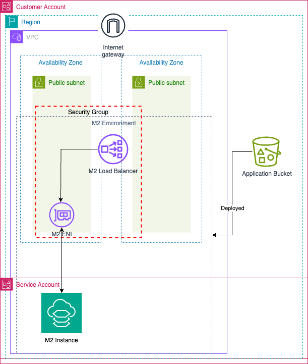

# AWS Mainframe Modernization now available in Terraform

This Terraform code is the companion to the AWS Mainframe Modernization now available in Terraform blog post.

## Example Archictecture

See [CONTRIBUTING](CONTRIBUTING.md#security-issue-notifications) for more information.

## License

This library is licensed under the MIT-0 License. See the LICENSE file.
